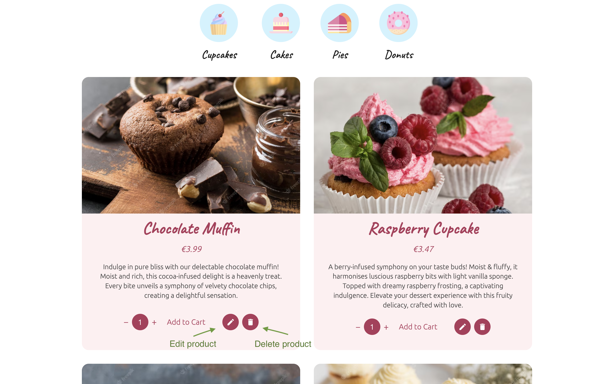
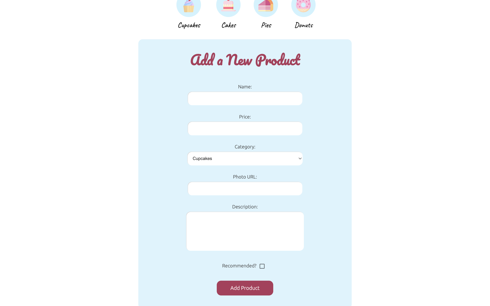

<h1 align="center">Sweet Delights - Online Patisserie</h1>

<a href="https://sweet-delights-patisserie.netlify.app/">LINK TO THE PAGE</a>

<h2 align="center">Technologies Used</h2>

The project comprises a full-stack e-commerce application (online patisserie) created by using the following technologies:

- **React:** written in TypeScript. Additionally, the project uses several React libraries, such as **React Router** (for handling routes), **React Hook Form** (for handling user input and form validation) and **Swiper** (for creating dynamically changing sliding components);
- **Express.js**: for the backend, using additional libraries such as bcrypt (for hashing the passwords) and cookie parser (for the management of sessions);
- **MongoDB** was used as a database. The project uses the Mongoose library to manipulate the data stored in the database.

<h2 align="center">User Functionalities</h2>

The application enables the user to purchase vegan, no-sugar sweets. The following main functionalities can be differentiated:

<h3 align="center">Products</h3>

The homepage displays currently recommended products from different categories in the form of a dynamic swiper where the slide components are changed every few seconds. From there (as well as from any other part of the shop), they can also choose one of the four product categories: cupcakes, cakes, pies, and donuts. Both on the homepage and inside of each category, you can add the number of items that you would like to buy and add them by clicking "Add to Cart".

<h3 align="center">Login/Registration</h3>

You can log in as an existing user or sign up for an account if you don't have one yet. Each passwords are hashed by the use of a hashing function and salt before they are stored in the database. The information about the current user is stored in the session, so that they are not logged out after the refreshing the page.

<h3 align="center">Cart</h3>

In the cart (stored in the local storage for now), you can see all the products that you previously added. From there, you can still increase/decrease the number of items to buy before heading to Shipping & Payment. There, you are asked to fill in your shipping address as well as choose the payment option. After you have placed the order, a purchase summary and a thank-you message are displayed.

<h3 align="center">About</h3>

This site is purely informative, as it shortly presents the business's history, its values and contact data.

<h2 align="center">Admin Functionalities</h2>

In addition to regular users' functionalities, the website also includes a number of features accessible also to the logged-in admin.

<h3 align="center">Edit/Delete Item</h3>

At the bottom of each item, next to the cart options, the admin has the option of deleting the item (this function cannot be reversed, as it permanently deletes the product from the database) or editing it:

The product editing page looks as follows, with the current product data being prepopulated for the admin:

<h3 align="center">Add Product</h3>

The admin can also add a new product to the database by clicking "Add Product" displayed on the navigation bar. The new product page looks analogically to the editing product page:

<h2 align="center">Project Installation</h2>

To install the project, enter /frontend and /backend, and run _npm install_ in each of the directories.
